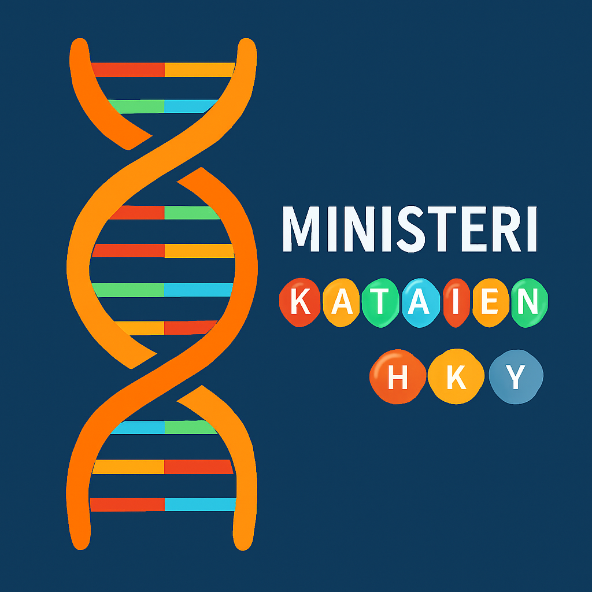

# 🧬 DNA-RNA-Polypeptide Tool

A tool that encodes English words into DNA sequences and translates them into RNA and amino acid chains using one-letter amino acid codes. Includes a graphical user interface (GUI) built with Qt6 for visualizing sequences and highlighting embedded words.

## 🚀 Features

- 🧬 Encode 1–3 words into DNA using codon substitutions
- 🔍 Search or scan DNA sequences for encodable words in all 6 reading frames
- 🎨 Qt6 GUI with resizable layout and color-coded visualization
- 📆 Binary builds for **Windows (.exe)** and **Linux (AppImage)** available on the [Releases](../../releases) page
- ❄️ Works offline with cached word lists
- 🧰 Built with [Nuitka](https://nuitka.net/) for standalone executable generation

## 📅 Download

👉 Precompiled binaries will be available on the [Releases](../../releases) page once the first official version is published.

You can also run from source:

```bash
pip install -r requirements.txt
python dnaencoder_GUI.py
```

## 🖼 Screenshot



## 🥪 Example: Default DNA Sequence

The built-in DNA sequence contains:
- `KATAINEN` (a Finnish surname) in frame 2
- `MINISTERI` (Finnish for “minister”) in frame 3

Try searching or embedding them in the GUI!

## ⚖️ License

This project is licensed under the [MIT License](LICENSE).

(C) 2025 Jari Hiltunen / GitHub [Divergentti](https://github.com/Divergentti)

---

## 💪 Building from Source

To build standalone binaries manually using Nuitka:

```bash
pip install nuitka pyside6 nltk appdirs tenacity
python -m nuitka dnaencoder_GUI.py \
  --standalone \
  --onefile \
  --follow-imports \
  --enable-plugin=pyside6 \
  --include-module=appdirs,nltk,tenacity \
  --include-data-dir=nltk_data=nltk_data \
  --output-dir=build \
  --output-filename=DNAtoPolypeptideMessageEncoder
```

You can also use the automated GitHub Actions workflow in `.github/workflows/build.yml` to generate binaries for both Windows and Linux.

---

## 🔧 Developer Notes

- Valid English words are pre-filtered from the NLTK corpus using one-letter amino acid codes
- Cached word list is stored in `~/.local/share/DNA To Polypeptide Encoder/possiblewords.json`
- Default DNA test sequence contains known Finnish words for demo purposes
- To regenerate the word list, delete the JSON cache and run the app

Happy encoding! 🧬🌟
